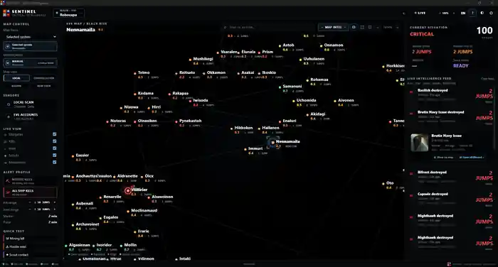

<div align="center">


# SENTINEL // TACTICAL INTELLIGENCE

### **Deine Tactical Intelligence Zentrale für New Eden.**

### **Entwickelt mit dem Anspruch, das leistungsfähigste Tactical-Intelligence-Tool für EVE Online zu werden.**

<br>

**LIVE KILL MAP · UNIQUE TACTICAL LIVE MAP WARNING SYSTEM · MULTI-CHANNEL INTEL MAP**

<br>


<br>

[🇬🇧 English](README.md) · **🇩🇪 Deutsch**

</div>

<p align="center">
  <a href="https://raw.githubusercontent.com/Robocapa-eve/sentinel-releases/main/assets/screenshots/sentinel-tactical-intelligence-overview-full.webp">
    
  </a>
</p>

<p align="center">
  <sub>SENTINEL Tactical-Intelligence-Übersicht · Zum Vergrößern anklicken</sub>
</p>

---

## KEIN WEITERES KILLBOARD. KEINE WEITERE STATISCHE MAP.

SENTINEL wird als dedizierte Tactical-Intelligence-Zentrale für EVE Online entwickelt.

Die Plattform verbindet **Live-Kill-Aktivität in New Eden, mehrere Intel-Channels, taktische Map-Warnungen, Jump-Distance-Awareness, Monitoring-Origin-Kontext, Routing-Informationen, Scout-/Watchlist-Intelligence und native Windows-Warnungen** zu einem gemeinsamen operativen Lagebild.

> **SENTINEL zeigt Kills nicht einfach nur an. Es verwandelt Live-Events in verwertbare taktische Intelligence.**

### **Gefahr sehen. Entfernung kennen. Route beobachten. Reagieren, bevor sie dich erreicht.**

---

# FINDE DIE GEFAHR. FINDE DEN CONTENT.

### **SENTINEL zeigt dir nicht nur, was du meiden solltest – sondern auch, wo New Eden gerade lebt.**

Live-Kill-Aktivität aus New Eden macht aktive Systeme und entstehende Hotspots direkt auf der Tactical Map sichtbar. Dieselbe Intelligence kann eine Mining-Operation, Hauling-Route, PvE-Pocket oder ein Staging-System schützen — oder einem Hunter, Scout oder Roamer helfen, Action zu finden und zu entscheiden, wohin der nächste Flug geht.

SENTINEL ist nicht für nur einen Spielstil gebaut. Es richtet sich an **Miner, Hauler, PvE-Piloten, Explorer, Scouts, Hunter, Roamer, Fleets und Corporations**, die ein klareres taktisches Bild des Raums um sich herum wollen.

> **Dieselbe Intelligence, die einem Miner zeigt, wo er besser nicht hinfliegt, kann einem Roamer zeigen, wo er als Nächstes hinfliegen sollte.**

**Gefahr meiden. Action finden. Den Raum um dich herum verstehen.**

---

# DREI SYSTEME DEFINIEREN SENTINEL

## 💀 LIVE KILL MAP

### **Live-Kill-Aktivität in New Eden — analysiert, auf der Map dargestellt und konfigurierbar.**

SENTINEL verarbeitet Live-Kill-Aktivität und löst sie gegen den New-Eden-Universe-Graph auf, damit Ereignisse direkt Teil der Tactical Map werden können statt isolierte Feed-Einträge zu bleiben.

Der Pilot erhält damit unter anderem unmittelbaren Kontext zu:

- Event-System,
- Jump-Distance vom aktiven Monitoring Origin,
- Aktualität des Events,
- Ship-/Kill-Kontext,
- Position auf der Map,
- und dem umliegenden Routing-Kontext.

Die taktische Darstellung lässt sich über Systeme wie Kill Range, Marker Persistence, Pulse-/Radar-Lifetime, Threat-Farben und Alert-Verhalten anpassen.

Das Ergebnis lässt sich in beide Richtungen nutzen: **Gefahr rund um deine Operation erkennen oder New Eden nach aktiven Gebieten und möglichem Content absuchen.**

Ein Kill mehrere Jumps entfernt wird dann wirklich nützlich, wenn du weißt **wo er passiert ist, wie nah er ist und ob seine Route für dich relevant wird.**

---

## 🚨 UNIQUE TACTICAL LIVE MAP WARNING SYSTEM

### **Dein Overview zeigt dir, was auf Grid ist. SENTINEL hilft dir zu verstehen, was dahinter passiert.**

SENTINELs **Unique Tactical Live Map Warning System** ist dafür gebaut, relevante Live-Aktivität in eine aktive Warning-Layer rund um die Position zu verwandeln, die du tatsächlich überwachst.

Es verbindet:

- Live Map Indicators,
- Tactical Pulses,
- konfigurierbare Jump Ranges,
- Event Persistence,
- Monitoring-Origin-Awareness,
- Route- und System-Kontext,
- native Windows-Audio-Warnungen,
- getrennte Kill-/Intel-Alertprofile,
- und Threat-orientierte visuelle Darstellung.

Defensiv sorgt das für frühere Awareness bei Aktivität, die deine Operation betreffen könnte. Offensiv zeigt dasselbe Live-Lagebild, wo sich Action entwickelt und wo der nächste Fight oder Roaming-Stop liegen könnte.

Das Ziel ist einfach: die Zeit zwischen **etwas passiert in New Eden** und **der Pilot versteht, ob es für ihn relevant ist** so kurz wie möglich zu halten.

> **Von rohen Kill-Events zu taktischem Lagebewusstsein.**

---

## 🛰️ MULTI-CHANNEL INTEL MAP

### **Mehrere Intel-Channels. Eine Map. Ein taktisches Lagebild.**

EVE-Intel kommt selten aus nur einer perfekten Quelle.

SENTINEL kann lokale EVE-Chatlog-Channels erkennen und lässt Piloten mehrere Intel-Channels gezielt für die Überwachung aktivieren. Relevante Meldungen werden geparst, aufgelöst und New-Eden-Systemen zugeordnet, bevor sie in denselben taktischen Kontext einfließen wie Kill-, Scout-, Watchlist- und Threat-Systeme.

Damit muss der Pilot nicht mehrere Chatfenster, eine separate Map und einen Route Planner im Kopf zusammenbauen.

### **Eine Map. Mehrere Intelligence-Quellen. Ein taktisches Lagebild.**

---

# VOM EVENT ZUR WARNUNG

```text
LIVE KILL / INTEL EVENT
          ↓
SYSTEM- & ENTITY-RESOLUTION
          ↓
DISTANZ ZUM MONITORING ORIGIN
          ↓
TAKTISCHE RELEVANZ
          ↓
LIVE MAP INDICATOR
          ↓
VISUELLE + NATIVE AUDIO-WARNUNG
          ↓
SYSTEM TOOLTIP / ROUTE-KONTEXT
```

Das ist die zentrale SENTINEL-Philosophie:

> **Informationen sollen die Reaktionszeit verkürzen – nicht zusätzlichen Lärm erzeugen.**

---

# EINE SPEZIALISIERTE MISSION

Für EVE Online existieren hunderte Tools. Manche berechnen Fits, manche analysieren Märkte, manche planen Industrie, manche zeigen Killboards und manche liefern Karten.

SENTINEL konzentriert sich bewusst auf eine andere Ebene des EVE-Spielens:

### **Taktisches Lagebewusstsein, bevor die Situation auf deinem Grid ankommt.**

Wer bewegt sich? Was stirbt gerade? Wo entwickelt sich Aktivität? Wie weit ist sie entfernt? Kommt sie in Richtung deines Gebiets? Ist das Gefahr — oder genau der Content, den du suchst?

**SENTINEL wurde gebaut, um dir diese Fragen schneller zu beantworten.**

---

# GEBAUT, UM DEIN EVE-TOOLSET ZU ERGÄNZEN

### **SENTINEL wurde nicht entwickelt, um jedes andere EVE-Tool zu ersetzen.**

EVE-Piloten nutzen bereits spezialisierte Drittanbieter-Tools für Fits, Märkte, Industrie, Killboards, Navigation, Fleet Operations und viele andere Aufgaben. SENTINEL ergänzt dieses Setup um eine eigene **Tactical-Intelligence- und Warning-Layer**.

Lass SENTINEL parallel zu EVE, Comms, Maps, Killboards und den Third-Party-Tools laufen, denen du bereits vertraust — oder nutze es allein als deine Tactical Intelligence Zentrale.

### **KEEP YOUR TOOLS. ADD INTELLIGENCE.**

> **Gebaut, um zu dem taktischen Fenster zu werden, das bei jedem Undock einfach mitläuft.**

---

# TACTICAL INTELLIGENCE STACK

Zusätzlich zu den drei definierenden Kernsystemen enthält oder entwickelt SENTINEL aktuell unter anderem:

- 🗺️ Vollständige New-Eden Tactical Map und Stargate Graph
- 🧭 Jump-Distance- und Route-Kontext
- 🎯 AUTO · MAIN und manuelle Tactical Monitoring Origins
- 👁️ Scout- und Watchlist-Kontext
- 📡 Persistenten Live Intelligence Feed
- 🧠 Erklärbaren Threat-/Risk-Kontext
- 🔍 Local Scan Workflow
- 📁 Tactical System Tooltips
- 🔔 Native Windows Kill- und Intel-Audio-Warnungen
- 🪟 Dedizierte Windows-Anwendung und System Tray
- 🎛️ Persistentes 100 / 110 / 120% Side-HUD Scaling
- 🔐 EVE SSO / ESI Integration
- 🔄 Verifizierte One-Click-Update-Auslieferung

SENTINEL soll Gameplay-Entscheidungen unterstützen und **keine Gameplay-Eingaben automatisieren**.

---

# AKTUELLER ÖFFENTLICHER BUILD

| | |
|---|---|
| **Letzter öffentlicher Build** | `0.2.30-alpha` |
| **Channel** | Alpha / pre-release |
| **Plattform** | Windows x64 |
| **Entwicklung** | Aktiv |
| **Source Code** | Privat |

> [!IMPORTANT]
> SENTINEL ist aktuell ein **Alpha-Projekt**. Features, Interface-Verhalten und interne Systeme können sich weiter verändern, während die Plattform für breitere öffentliche Nutzung getestet und gehärtet wird.

### 🚀 [GitHub Releases](https://github.com/Robocapa-eve/sentinel-releases/releases)

Veröffentlichte Windows Builds und Release Assets befinden sich in GitHub Releases.

---

# ENTWICKLUNG VERFOLGEN

### 📡 [Development Log / Changelog](CHANGELOG.md)

Die öffentliche Entwicklungschronik dokumentiert wichtige SENTINEL-Meilensteine für Piloten und Entwickler.

Sie beschreibt den Weg von der Tactical Foundation über:

- die native Windows-Anwendung,
- die Tactical-Monitoring-Origin-Architektur,
- Live-Intelligence- und Map-Verbesserungen,
- verifizierte Update-Auslieferung,
- Security- und Dependency-Hardening,
- Native-Alert-Reliability,
- bis zur aktuellen Interface-/HUD-Entwicklung.

Die Source-Implementierung bleibt privat, während die Entwicklung für die EVE-Community nachvollziehbar bleibt.

---

# RELEASE TRUST

Die aktuelle Release-Auslieferung verifiziert den Windows Installer per SHA-256 vor der Ausführung.

Zur Security-Baseline gehören außerdem automatisiertes Secret Scanning, Dependency Vulnerability Auditing und dedizierte Security-/Privacy-Dokumentation im privaten Source Repository.

Weitere Release-Trust-Schritte unter Betrachtung sind Windows Code Signing und kryptografisch signierte Update-Metadaten.

---

# ÖFFENTLICHER FORTSCHRITT, PRIVATER SOURCE CODE

Das private SENTINEL Repository enthält Implementierung, interne Pull Requests, automatisierte Tests und Engineering-Details.

Dieses öffentliche Repository existiert, damit Piloten Releases, Fortschritt und Entwicklungsrichtung verfolgen können, **ohne dass der Anwendungscode öffentlich sein muss**.

### **→ [SENTINEL Development Log lesen](CHANGELOG.md)**

---

<div align="center">

## SENTINEL // TACTICAL INTELLIGENCE

**Deine Tactical Intelligence Zentrale für New Eden.**

**LIVE KILL MAP · UNIQUE TACTICAL LIVE MAP WARNING SYSTEM · MULTI-CHANNEL INTEL MAP**

### **Schütze dich. Finde die Action. Verstehe, was jenseits deines Grids passiert.**

### **KEEP YOUR TOOLS. ADD INTELLIGENCE.**

<br>

[🇬🇧 English](README.md) · **🇩🇪 Deutsch**

<br><br>

<sub>
SENTINEL ist ein unabhängiges Drittanbieter-Projekt für EVE Online und steht in keiner Verbindung zu CCP Games und wird nicht von CCP Games unterstützt oder empfohlen.<br>
EVE Online und zugehörige Marken sind Eigentum von CCP hf.
</sub>

**Developer:** Robocapa

</div>
